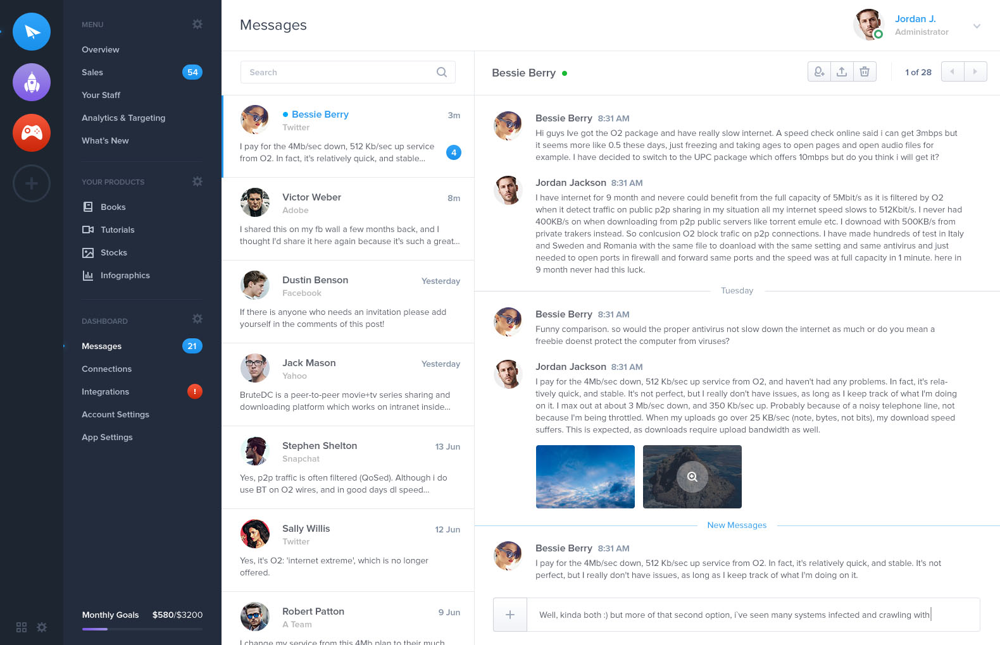

使用VS Code等开发工具，按照如下设计图，进行页面的实现

说明：

<ul>
<li>最左侧一列要求自适应浏览器高度，左上面4个按钮相对浏览器左上角固定位置，左下方两个按钮相对浏览器左下角固定位置</li>
<li>左侧第二列(蓝色背景色)导航列固定宽度，高度也是自适应浏览器高度，最下面的Monthly Goals部分的内容相对浏览器下边固定位置</li>
<li>整个白色区域自适应宽度，右上方的人脸，名字部分相对浏览器右上角固定位置</li>
<li>白色区域左侧列固定宽度，右侧列自适应宽度</li>
</ul>